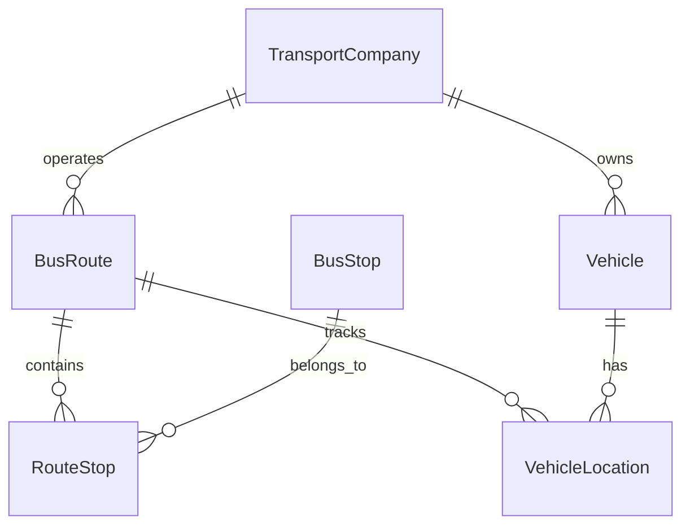

# 📚 Documentação Técnica - BusFeed

## 🏗️ Arquitetura do Sistema

### Padrões Arquiteturais

O BusFeed implementa **Clean Architecture** com os seguintes princípios:

- **Separação de Responsabilidades**: Cada módulo tem uma responsabilidade específica
- **Inversão de Dependência**: Módulos de alto nível não dependem de implementações
- **Testabilidade**: Código facilmente testável com mocks e stubs
- **Flexibilidade**: Fácil mudança de tecnologias sem afetar regras de negócio

### Estrutura de Camadas

```
┌─────────────────────────────────────┐
│           Presentation Layer        │  ← Templates, Views, APIs
├─────────────────────────────────────┤
│           Application Layer         │  ← Use Cases, Coordinators
├─────────────────────────────────────┤
│             Domain Layer            │  ← Models, Business Logic
├─────────────────────────────────────┤
│        Infrastructure Layer        │  ← Database, External APIs
└─────────────────────────────────────┘
```

## 📦 Módulos do Sistema

### Core Module
**Responsabilidade**: Funcionalidades centrais e modelos base

```python
# core/models.py
class BaseModel(TimestampedModel, SoftDeleteModel):
    """Modelo base com UUID, timestamps e soft delete"""
    id = models.UUIDField(primary_key=True, default=uuid.uuid4)

class GeoModel(models.Model):
    """Modelo base para funcionalidades geográficas"""
    latitude = models.FloatField(null=True, blank=True)
    longitude = models.FloatField(null=True, blank=True)
```

### Routes Module
**Responsabilidade**: Gestão de rotas de ônibus

**Modelos principais**:
- `BusRoute`: Rota completa com trajetos
- `RouteStop`: Relação rota-parada com sequência
- `Vehicle`: Veículos da frota
- `VehicleLocation`: Localização GPS em tempo real

### Stops Module
**Responsabilidade**: Gestão de paradas de ônibus

**Funcionalidades**:
- Cadastro de paradas
- Informações de acessibilidade
- Busca geográfica por proximidade

### Schedules Module
**Responsabilidade**: Horários e cronogramas

**Funcionalidades**:
- Horários programados
- Previsões em tempo real
- Alertas de atraso

### Notifications Module
**Responsabilidade**: Sistema de notificações

**Tipos de notificação**:
- Alertas de serviço
- Mudanças de horário
- Atualizações de rota

## 🗄️ Modelo de Dados

### Relacionamentos Principais



### Índices de Performance

```python
# Índices otimizados para consultas frequentes
class Meta:
    indexes = [
        models.Index(fields=['latitude', 'longitude']),  # Busca geográfica
        models.Index(fields=['route', 'sequence']),      # Ordem de paradas
        models.Index(fields=['created_at']),             # Ordenação temporal
        models.Index(fields=['is_active']),              # Filtro de ativos
    ]
```

## ⚡ Performance e Otimização

### Cache Strategy

```python
# Cache hierárquico por frequência de mudança
CACHE_TIMEOUTS = {
    'routes': 3600,      # 1 hora - rotas mudam pouco
    'stops': 7200,       # 2 horas - paradas são estáticas  
    'schedules': 300,    # 5 minutos - horários mudam
    'realtime': 30,      # 30 segundos - dados dinâmicos
}
```

### Query Optimization

```python
# Uso de select_related para reduzir queries
routes = BusRoute.objects.select_related('transport_company', 'route_type')

# Prefetch para relacionamentos many-to-many
routes = routes.prefetch_related('route_stops__stop')

# Uso de only() para limitar campos
stops = BusStop.objects.only('name', 'latitude', 'longitude')
```

### Database Optimization

```sql
-- Índices compostos para consultas complexas
CREATE INDEX idx_route_stop_sequence ON routes_routestop(route_id, direction, sequence);

-- Índice geográfico para busca por proximidade
CREATE INDEX idx_stop_location ON stops_busstop USING GIST (point(longitude, latitude));
```

## 🔒 Segurança

### Validação de Dados

```python
# Validadores customizados
class CoordinateValidator:
    def validate_latitude(self, value):
        if not -90 <= value <= 90:
            raise ValidationError('Latitude inválida')
    
    def validate_longitude(self, value):
        if not -180 <= value <= 180:
            raise ValidationError('Longitude inválida')
```

### Rate Limiting

```python
# Throttling para APIs
REST_FRAMEWORK = {
    'DEFAULT_THROTTLE_RATES': {
        'anon': '100/hour',
        'user': '1000/hour',
        'burst': '10/min',
    }
}
```

### CSRF Protection

```python
# Proteção CSRF para formulários
@csrf_protect
def route_create_view(request):
    if request.method == 'POST':
        # Processar formulário seguro
        pass
```

## 🧪 Testes

### Estrutura de Testes

```
tests/
├── unit/           # Testes unitários
│   ├── test_models.py
│   ├── test_views.py
│   └── test_utils.py
├── integration/    # Testes de integração
│   ├── test_api.py
│   └── test_workflows.py
├── functional/     # Testes funcionais
│   └── test_user_flows.py
└── fixtures/       # Dados de teste
    └── test_data.json
```

### Cobertura de Testes

```bash
# Executar com cobertura
coverage run --source='.' manage.py test
coverage report --show-missing
coverage html

# Meta: manter cobertura > 85%
```

### Testes de Performance

```python
# Django's TestCase com profiling
class PerformanceTestCase(TestCase):
    def test_route_list_performance(self):
        with self.assertNumQueries(3):  # Máximo 3 queries
            response = self.client.get('/routes/')
            self.assertEqual(response.status_code, 200)
```

## 📊 Monitoramento

### Logging Strategy

```python
# Loggers específicos por módulo
LOGGING = {
    'loggers': {
        'routes': {'level': 'INFO', 'handlers': ['file']},
        'stops': {'level': 'INFO', 'handlers': ['file']},
        'performance': {'level': 'DEBUG', 'handlers': ['metrics']},
    }
}
```

### Métricas Customizadas

```python
# Middleware para métricas de performance
class MetricsMiddleware:
    def __init__(self, get_response):
        self.get_response = get_response

    def __call__(self, request):
        start_time = time.time()
        response = self.get_response(request)
        duration = time.time() - start_time
        
        # Enviar métrica para Prometheus/Grafana
        metrics.histogram('request_duration', duration)
        return response
```

## 🔧 Deployment

### Docker Configuration

```dockerfile
FROM python:3.9-slim

WORKDIR /app
COPY requirements.txt .
RUN pip install -r requirements.txt

COPY . .
EXPOSE 8000

CMD ["gunicorn", "busfeed.wsgi:application"]
```

### Environment Variables

```yaml
# docker-compose.yml
version: '3.8'
services:
  web:
    build: .
    environment:
      - DEBUG=False
      - DATABASE_URL=postgresql://...
      - REDIS_URL=redis://redis:6379
    depends_on:
      - db
      - redis
```

### Health Checks

```python
# views.py
def health_check(request):
    """Endpoint para verificação de saúde do sistema"""
    checks = {
        'database': check_database(),
        'cache': check_cache(),
        'external_apis': check_external_apis(),
    }
    
    status = 'healthy' if all(checks.values()) else 'unhealthy'
    return JsonResponse({'status': status, 'checks': checks})
```

## 🔄 CI/CD Pipeline

### GitHub Actions

```yaml
# .github/workflows/django.yml
name: Django CI

on: [push, pull_request]

jobs:
  test:
    runs-on: ubuntu-latest
    steps:
    - uses: actions/checkout@v2
    - name: Set up Python
      uses: actions/setup-python@v2
      with:
        python-version: 3.9
    - name: Install dependencies
      run: pip install -r requirements.txt
    - name: Run tests
      run: python manage.py test
    - name: Run linting
      run: flake8 .
```

## 📈 Escalabilidade

### Horizontal Scaling

```python
# Load balancer configuration
ALLOWED_HOSTS = ['busfeed.com', '*.busfeed.com']

# Session store em Redis para múltiplas instâncias
SESSION_ENGINE = 'django.contrib.sessions.backends.cache'
SESSION_CACHE_ALIAS = 'default'
```

### Database Sharding

```python
# Database routing para read replicas
class DatabaseRouter:
    def db_for_read(self, model, **hints):
        return 'replica' if model._meta.app_label in ['routes', 'stops'] else 'default'
    
    def db_for_write(self, model, **hints):
        return 'default'
```

### Async Tasks

```python
# Celery para tarefas assíncronas
@shared_task
def update_realtime_data():
    """Atualiza dados em tempo real das APIs externas"""
    for route in BusRoute.objects.filter(is_active=True):
        fetch_realtime_data.delay(route.id)
```

## 🔮 Roadmap Técnico

### Próximas Implementações

1. **WebSocket**: Dados em tempo real via WebSocket
2. **GraphQL**: API GraphQL para consultas flexíveis
3. **Machine Learning**: Previsões inteligentes de atraso
4. **Microservices**: Divisão em microserviços independentes
5. **PWA**: Progressive Web App para mobile

### Melhorias de Performance

1. **CDN**: Content Delivery Network para assets
2. **Cache Distributed**: Redis Cluster para alta disponibilidade
3. **Database Optimization**: Particionamento de tabelas grandes
4. **Async Views**: Views assíncronas com Django 4.1+

---

**Última atualização**: 2025-01-11
**Versão**: 1.0.0 