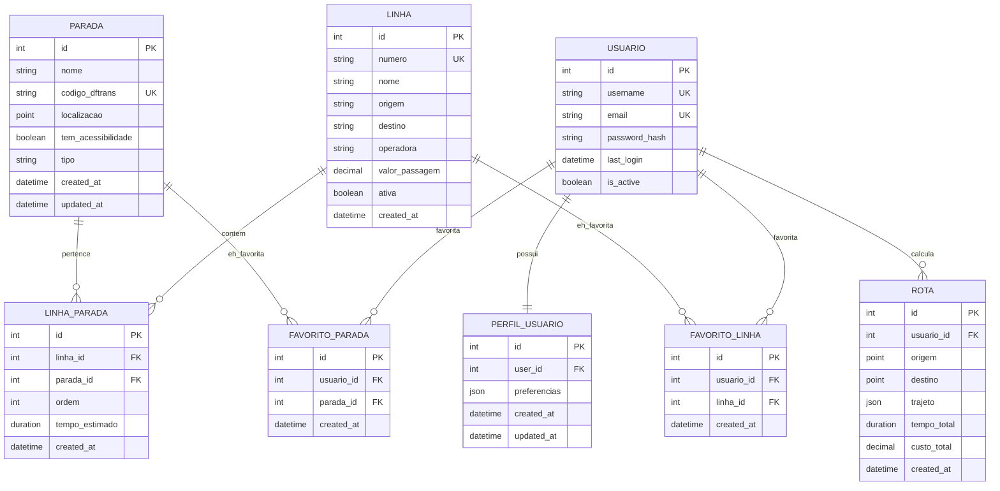

# 🏗️ Arquitetura Técnica - BusFeed

## 📐 Visão Geral da Arquitetura

O BusFeed segue uma arquitetura **modular orientada a domínios**, implementando o padrão **MVC** no backend Django e **Component-Based Architecture** no frontend React.

### 🎯 Princípios Arquiteturais
- **Separação de Responsabilidades**: Cada módulo tem uma função específica
- **Baixo Acoplamento**: Módulos independentes com interfaces bem definidas
- **Alta Coesão**: Funcionalidades relacionadas agrupadas
- **Escalabilidade**: Estrutura preparada para crescimento
- **Manutenibilidade**: Código organizado e documentado

---

## 🔧 Stack Tecnológica Detalhada

### Backend - Django Framework
```python
# Estrutura dos Apps por Domínio
busfeed/
├── busfeed/                 # Configurações do projeto
│   ├── settings.py         # Configurações centralizadas
│   ├── urls.py             # Roteamento principal
│   └── wsgi.py             # Interface WSGI
├── paradas/                # Domínio: Paradas de Ônibus
│   ├── models.py           # Modelos de dados
│   ├── views.py            # Lógica de apresentação
│   ├── serializers.py      # Serialização DRF
│   ├── urls.py             # Rotas específicas
│   └── management/         # Comandos customizados
├── linhas/                 # Domínio: Linhas de Ônibus
├── rotas/                  # Domínio: Cálculo de Rotas
├── usuarios/               # Domínio: Gestão de Usuários
└── services/               # Serviços compartilhados
    └── dftrans_api.py      # Integração externa
```

### Frontend - React Architecture
```javascript
// Estrutura de Componentes
frontend/src/
├── components/
│   ├── common/             // Componentes reutilizáveis
│   │   ├── Header.js       // Navegação principal
│   │   ├── SearchForm.js   // Formulário de busca
│   │   └── RouteResult.js  // Card de resultado
│   └── map/                // Componentes específicos de mapa
│       ├── MapView.js      // Mapa principal com Leaflet
│       └── RouteDetails.js // Detalhes de rota
├── pages/                  // Páginas da aplicação
│   ├── Home.js             // Dashboard principal
│   ├── ParadasPage.js      // Lista interativa de paradas
│   ├── LinhasPage.js       // Catálogo de linhas
│   └── MapPage.js          // Mapa em tela cheia
├── services/               // Camada de serviços
│   ├── api.js              // Cliente HTTP configurado
│   └── routeService.js     // Lógica de rotas
└── styles/                 // Estilos organizados
    ├── App.css             // Estilos globais
    └── colors.css          // Paleta de cores
```

---

## 🗄️ Modelagem de Dados

### 📊 Diagrama Entidade-Relacionamento



### 🔗 Relacionamentos Principais

#### 1. Paradas ↔ Linhas (Many-to-Many)
```python
class LinhaParada(models.Model):
    """
    Relacionamento entre Linhas e Paradas com informações adicionais
    """
    linha = models.ForeignKey('Linha', on_delete=models.CASCADE)
    parada = models.ForeignKey('Parada', on_delete=models.CASCADE)
    ordem = models.PositiveIntegerField()  # Sequência na rota
    tempo_estimado = models.DurationField(null=True, blank=True)
    
    class Meta:
        unique_together = ['linha', 'parada', 'ordem']
        ordering = ['ordem']
        indexes = [
            models.Index(fields=['linha', 'ordem']),
            models.Index(fields=['parada']),
        ]
```

#### 2. Usuários ↔ Favoritos
```python
class PerfilUsuario(models.Model):
    """
    Extensão do modelo User do Django com funcionalidades específicas
    """
    user = models.OneToOneField(User, on_delete=models.CASCADE)
    paradas_favoritas = models.ManyToManyField(
        'paradas.Parada',
        through='FavoritoParada',
        blank=True
    )
    linhas_favoritas = models.ManyToManyField(
        'linhas.Linha',
        through='FavoritoLinha',
        blank=True
    )
    preferencias = models.JSONField(default=dict)
    
    def __str__(self):
        return f"Perfil de {self.user.username}"
```

---

## 🚀 APIs e Endpoints

### 📡 Estrutura de URLs
```python
# busfeed/urls.py - Roteamento principal
urlpatterns = [
    path('admin/', admin.site.urls),
    path('api/auth/', include('usuarios.urls')),
    path('api/paradas/', include('paradas.urls')),
    path('api/linhas/', include('linhas.urls')),
    path('api/rotas/', include('rotas.urls')),
    path('api/docs/', schema_view.with_ui('swagger')),  # Documentação
]
```

### 🔌 Endpoints por Módulo

#### Paradas API
```python
# paradas/urls.py
urlpatterns = [
    path('', ParadaListCreateView.as_view(), name='parada-list'),
    path('<int:pk>/', ParadaDetailView.as_view(), name='parada-detail'),
    path('proximas/', ParadasProximasView.as_view(), name='paradas-proximas'),
    path('autocomplete/', AutocompleteParadasView.as_view(), name='autocomplete'),
    path('por-linha/<str:linha_numero>/', ParadasPorLinhaView.as_view()),
]
```

```python
# paradas/views.py - Exemplo de View com PostGIS
class ParadasProximasView(APIView):
    """
    Busca paradas próximas a um ponto geográfico
    """
    def get(self, request):
        lat = float(request.GET.get('latitude'))
        lng = float(request.GET.get('longitude'))
        raio = int(request.GET.get('raio', 1000))  # metros
        
        ponto_usuario = Point(lng, lat, srid=4326)
        
        paradas = Parada.objects.filter(
            localizacao__distance_lte=(ponto_usuario, D(m=raio))
        ).annotate(
            distancia=Distance('localizacao', ponto_usuario)
        ).order_by('distancia')[:20]
        
        serializer = ParadaProximaSerializer(paradas, many=True)
        return Response(serializer.data)
```

#### Linhas API
```python
# linhas/views.py - ViewSet com ações customizadas
class LinhaViewSet(viewsets.ModelViewSet):
    queryset = Linha.objects.all()
    serializer_class = LinhaSerializer
    filter_backends = [DjangoFilterBackend, SearchFilter]
    filterset_fields = ['operadora', 'ativa']
    search_fields = ['numero', 'nome', 'origem', 'destino']
    
    @action(detail=True, methods=['get'])
    def paradas(self, request, pk=None):
        """Retorna paradas da linha em ordem"""
        linha = self.get_object()
        paradas = linha.paradas.through.objects.filter(
            linha=linha
        ).select_related('parada').order_by('ordem')
        
        serializer = LinhaParadaSerializer(paradas, many=True)
        return Response(serializer.data)
    
    @action(detail=True, methods=['get'])
    def tempo_real(self, request, pk=None):
        """Integração com DFTrans para posição em tempo real"""
        linha = self.get_object()
        dftrans = DFTransAPI()
        posicoes = dftrans.obter_tempo_real(linha.numero)
        return Response(posicoes)
```

### 📊 Serializers DRF
```python
# paradas/serializers.py
class ParadaSerializer(serializers.ModelSerializer):
    """
    Serializer principal para Paradas
    """
    linhas = serializers.SerializerMethodField()
    coordenadas = serializers.SerializerMethodField()
    
    class Meta:
        model = Parada
        fields = [
            'id', 'nome', 'codigo_dftrans', 'tipo',
            'tem_acessibilidade', 'coordenadas', 'linhas'
        ]
    
    def get_linhas(self, obj):
        """Retorna linhas que passam na parada"""
        return obj.linhas.values_list('numero', flat=True)
    
    def get_coordenadas(self, obj):
        """Converte Point para [lat, lng]"""
        if obj.localizacao:
            return [obj.localizacao.y, obj.localizacao.x]
        return None

class ParadaProximaSerializer(ParadaSerializer):
    """
    Serializer para paradas próximas com distância
    """
    distancia = serializers.SerializerMethodField()
    
    class Meta(ParadaSerializer.Meta):
        fields = ParadaSerializer.Meta.fields + ['distancia']
    
    def get_distancia(self, obj):
        """Retorna distância em metros"""
        if hasattr(obj, 'distancia'):
            return round(obj.distancia.m, 2)
        return None
```

---

## 🎨 Frontend - Arquitetura React

### 🔄 Gerenciamento de Estado
```javascript
// services/api.js - Cliente HTTP centralizado
import axios from 'axios';

const api = axios.create({
  baseURL: process.env.REACT_APP_API_URL || 'http://localhost:8000/api',
  timeout: 10000,
  headers: {
    'Content-Type': 'application/json',
  }
});

// Interceptor para autenticação
api.interceptors.request.use(
  (config) => {
    const token = localStorage.getItem('authToken');
    if (token) {
      config.headers.Authorization = `Bearer ${token}`;
    }
    return config;
  },
  (error) => Promise.reject(error)
);

// Interceptor para tratamento de erros
api.interceptors.response.use(
  (response) => response,
  (error) => {
    if (error.response?.status === 401) {
      localStorage.removeItem('authToken');
      window.location.href = '/login';
    }
    return Promise.reject(error);
  }
);

export default api;
```

### 🧩 Componentes Reutilizáveis
```javascript
// components/common/Header.js - Navegação principal
import React from 'react';
import { Navbar, Nav, Container } from 'react-bootstrap';
import { LinkContainer } from 'react-router-bootstrap';

const Header = ({ showSearch = true }) => {
  return (
    <Navbar bg="primary" variant="dark" expand="lg" fixed="top">
      <Container>
        <LinkContainer to="/">
          <Navbar.Brand>
            🚌 BusFeed
          </Navbar.Brand>
        </LinkContainer>
        
        <Navbar.Toggle aria-controls="basic-navbar-nav" />
        <Navbar.Collapse id="basic-navbar-nav">
          <Nav className="me-auto">
            <LinkContainer to="/mapa">
              <Nav.Link>🗺️ Mapa</Nav.Link>
            </LinkContainer>
            <LinkContainer to="/paradas">
              <Nav.Link>🚏 Paradas</Nav.Link>
            </LinkContainer>
            <LinkContainer to="/linhas">
              <Nav.Link>🚌 Linhas</Nav.Link>
            </LinkContainer>
          </Nav>
          
          {showSearch && (
            <SearchForm />
          )}
        </Navbar.Collapse>
      </Container>
    </Navbar>
  );
};

export default Header;
```

### 🗺️ Integração com Mapas
```javascript
// components/map/MapView.js - Componente principal do mapa
import React, { useEffect, useState } from 'react';
import { MapContainer, TileLayer, Marker, Popup } from 'react-leaflet';
import L from 'leaflet';

// Configuração de ícones customizados
const busStopIcon = new L.Icon({
  iconUrl: '/icons/bus-stop.png',
  iconSize: [25, 25],
  iconAnchor: [12, 25],
  popupAnchor: [0, -25]
});

const MapView = ({ 
  center = [-15.8267, -48.1089], 
  zoom = 13, 
  height = "400px",
  onBusStopClick,
  userLocation,
  showUserLocation = false 
}) => {
  const [paradas, setParadas] = useState([]);
  
  useEffect(() => {
    // Carregar paradas próximas ao centro do mapa
    carregarParadas(center);
  }, [center]);
  
  const carregarParadas = async (centro) => {
    try {
      const response = await api.get('/paradas/proximas/', {
        params: {
          latitude: centro[0],
          longitude: centro[1],
          raio: 2000
        }
      });
      setParadas(response.data);
    } catch (error) {
      console.error('Erro ao carregar paradas:', error);
    }
  };
  
  return (
    <MapContainer
      center={center}
      zoom={zoom}
      style={{ height, width: '100%' }}
      scrollWheelZoom={true}
    >
      <TileLayer
        attribution='&copy; <a href="https://www.openstreetmap.org/copyright">OpenStreetMap</a>'
        url="https://{s}.tile.openstreetmap.org/{z}/{x}/{y}.png"
      />
      
      {/* Marcadores das paradas */}
      {paradas.map((parada) => (
        <Marker
          key={parada.id}
          position={parada.coordenadas}
          icon={busStopIcon}
          eventHandlers={{
            click: () => onBusStopClick && onBusStopClick(parada)
          }}
        >
          <Popup>
            <div>
              <h6>{parada.nome}</h6>
              <p>{parada.descricao}</p>
              <small>
                Linhas: {parada.linhas.join(', ')}
              </small>
            </div>
          </Popup>
        </Marker>
      ))}
      
      {/* Localização do usuário */}
      {showUserLocation && userLocation && (
        <Marker position={userLocation}>
          <Popup>Sua localização</Popup>
        </Marker>
      )}
    </MapContainer>
  );
};

export default MapView;
```

---

## 🔧 Integração com Serviços Externos

### 📡 DFTrans API Integration
```python
# services/dftrans_api.py
import requests
from django.conf import settings
from django.core.cache import cache
import logging

logger = logging.getLogger(__name__)

class DFTransAPI:
    """
    Cliente para integração com APIs da DFTrans
    """
    BASE_URL = "https://api.dftrans.df.gov.br/v1"
    TIMEOUT = 30
    
    def __init__(self):
        self.session = requests.Session()
        self.session.headers.update({
            'User-Agent': 'BusFeed/1.0',
            'Accept': 'application/json'
        })
    
    def sincronizar_linhas(self):
        """
        Sincroniza dados das linhas com DFTrans
        """
        try:
            response = self._get('/linhas')
            linhas_data = response.json()
            
            for linha_data in linhas_data:
                self._criar_ou_atualizar_linha(linha_data)
                
            logger.info(f"Sincronizadas {len(linhas_data)} linhas")
            
        except requests.RequestException as e:
            logger.error(f"Erro na sincronização: {e}")
            raise
    
    def obter_tempo_real(self, linha_numero):
        """
        Obtém posição dos ônibus em tempo real
        """
        cache_key = f"tempo_real_{linha_numero}"
        cached_data = cache.get(cache_key)
        
        if cached_data:
            return cached_data
        
        try:
            response = self._get(f'/tempo-real/{linha_numero}')
            data = response.json()
            
            # Cache por 30 segundos
            cache.set(cache_key, data, 30)
            return data
            
        except requests.RequestException as e:
            logger.error(f"Erro ao obter tempo real: {e}")
            return []
    
    def _get(self, endpoint):
        """
        Executa requisição GET com tratamento de erros
        """
        url = f"{self.BASE_URL}{endpoint}"
        response = self.session.get(url, timeout=self.TIMEOUT)
        response.raise_for_status()
        return response
    
    def _criar_ou_atualizar_linha(self, linha_data):
        """
        Cria ou atualiza linha no banco local
        """
        from linhas.models import Linha
        
        linha, created = Linha.objects.update_or_create(
            numero=linha_data['numero'],
            defaults={
                'nome': linha_data['nome'],
                'origem': linha_data['origem'],
                'destino': linha_data['destino'],
                'operadora': linha_data['operadora'],
                'valor_passagem': linha_data['valor_passagem'],
                'ativa': linha_data.get('ativa', True)
            }
        )
        
        if created:
            logger.info(f"Linha criada: {linha.numero}")
        else:
            logger.info(f"Linha atualizada: {linha.numero}")
```

### 🔄 Comandos de Gerenciamento
```python
# linhas/management/commands/sincronizar_dftrans.py
from django.core.management.base import BaseCommand
from services.dftrans_api import DFTransAPI

class Command(BaseCommand):
    help = 'Sincroniza dados das linhas com DFTrans'
    
    def add_arguments(self, parser):
        parser.add_argument(
            '--force',
            action='store_true',
            help='Força sincronização mesmo com dados recentes'
        )
    
    def handle(self, *args, **options):
        self.stdout.write('Iniciando sincronização com DFTrans...')
        
        try:
            dftrans = DFTransAPI()
            dftrans.sincronizar_linhas()
            
            self.stdout.write(
                self.style.SUCCESS('Sincronização concluída com sucesso!')
            )
            
        except Exception as e:
            self.stdout.write(
                self.style.ERROR(f'Erro na sincronização: {e}')
            )
            raise
```

---

## 🐳 Containerização e Deploy

### 🔧 Dockerfile Multi-stage
```dockerfile
# Dockerfile - Build otimizado
FROM python:3.11-slim as base

# Instalar dependências do sistema
RUN apt-get update && apt-get install -y \
    postgresql-client \
    gdal-bin \
    libgdal-dev \
    build-essential \
    && rm -rf /var/lib/apt/lists/*

WORKDIR /app

# Stage de dependências
FROM base as dependencies
COPY requirements.txt .
RUN pip install --no-cache-dir -r requirements.txt

# Stage de produção
FROM base as production
COPY --from=dependencies /usr/local/lib/python3.11/site-packages /usr/local/lib/python3.11/site-packages
COPY --from=dependencies /usr/local/bin /usr/local/bin

COPY . .

# Configurações de produção
ENV PYTHONUNBUFFERED=1
ENV DJANGO_SETTINGS_MODULE=busfeed.settings.production

EXPOSE 8000

# Health check
HEALTHCHECK --interval=30s --timeout=30s --start-period=5s --retries=3 \
  CMD curl -f http://localhost:8000/health/ || exit 1

CMD ["gunicorn", "--bind", "0.0.0.0:8000", "busfeed.wsgi:application"]
```

### 🚀 Docker Compose para Produção
```yaml
# docker-compose.prod.yml
version: '3.8'

services:
  db:
    image: postgis/postgis:15-3.3
    environment:
      POSTGRES_DB: ${DB_NAME}
      POSTGRES_USER: ${DB_USER}
      POSTGRES_PASSWORD: ${DB_PASSWORD}
    volumes:
      - postgres_data:/var/lib/postgresql/data
      - ./backups:/backups
    restart: unless-stopped
    
  redis:
    image: redis:7-alpine
    restart: unless-stopped
    
  backend:
    build:
      context: .
      target: production
    environment:
      - DATABASE_URL=postgis://${DB_USER}:${DB_PASSWORD}@db:5432/${DB_NAME}
      - REDIS_URL=redis://redis:6379/0
      - SECRET_KEY=${SECRET_KEY}
      - DEBUG=False
    depends_on:
      - db
      - redis
    restart: unless-stopped
    
  celery:
    build:
      context: .
      target: production
    command: celery -A busfeed worker -l info
    environment:
      - DATABASE_URL=postgis://${DB_USER}:${DB_PASSWORD}@db:5432/${DB_NAME}
      - REDIS_URL=redis://redis:6379/0
    depends_on:
      - db
      - redis
    restart: unless-stopped
    
  nginx:
    image: nginx:alpine
    ports:
      - "80:80"
      - "443:443"
    volumes:
      - ./nginx.conf:/etc/nginx/nginx.conf
      - ./static:/var/www/static
      - ./media:/var/www/media
    depends_on:
      - backend
    restart: unless-stopped

volumes:
  postgres_data:
```

---

## 📊 Performance e Otimização

### 🚀 Otimizações de Banco
```python
# paradas/models.py - Índices otimizados
class Parada(models.Model):
    nome = models.CharField(max_length=200, db_index=True)
    codigo_dftrans = models.CharField(max_length=50, unique=True)
    localizacao = models.PointField(spatial_index=True)  # Índice espacial
    
    class Meta:
        indexes = [
            models.Index(fields=['nome']),
            models.Index(fields=['tipo', 'tem_acessibilidade']),
            GistIndex(fields=['localizacao']),  # Índice GiST para PostGIS
        ]
```

### ⚡ Cache Strategy
```python
# settings.py - Configuração de cache
CACHES = {
    'default': {
        'BACKEND': 'django_redis.cache.RedisCache',
        'LOCATION': 'redis://127.0.0.1:6379/1',
        'OPTIONS': {
            'CLIENT_CLASS': 'django_redis.client.DefaultClient',
        }
    }
}

# Cache de sessão
SESSION_ENGINE = 'django.contrib.sessions.backends.cache'
SESSION_CACHE_ALIAS = 'default'
```

### 📈 Monitoramento
```python
# busfeed/middleware.py - Middleware de performance
import time
import logging

logger = logging.getLogger('performance')

class PerformanceMiddleware:
    def __init__(self, get_response):
        self.get_response = get_response
    
    def __call__(self, request):
        start_time = time.time()
        
        response = self.get_response(request)
        
        duration = time.time() - start_time
        
        if duration > 1.0:  # Log requests lentas
            logger.warning(
                f"Slow request: {request.path} took {duration:.2f}s"
            )
        
        response['X-Response-Time'] = f"{duration:.3f}s"
        return response
```

---

## 🔒 Segurança e Autenticação

### 🛡️ Configurações de Segurança
```python
# settings/production.py
SECURE_SSL_REDIRECT = True
SECURE_HSTS_SECONDS = 31536000
SECURE_HSTS_INCLUDE_SUBDOMAINS = True
SECURE_HSTS_PRELOAD = True
SECURE_CONTENT_TYPE_NOSNIFF = True
SECURE_BROWSER_XSS_FILTER = True
X_FRAME_OPTIONS = 'DENY'

# CORS para frontend
CORS_ALLOWED_ORIGINS = [
    "https://busfeed.df.gov.br",
    "https://app.busfeed.df.gov.br",
]
```

### 🔐 Autenticação JWT
```python
# usuarios/authentication.py
from rest_framework_simplejwt.authentication import JWTAuthentication
from rest_framework_simplejwt.tokens import RefreshToken

class CustomJWTAuthentication(JWTAuthentication):
    def authenticate(self, request):
        header = self.get_header(request)
        if header is None:
            return None
        
        raw_token = self.get_raw_token(header)
        if raw_token is None:
            return None
        
        validated_token = self.get_validated_token(raw_token)
        user = self.get_user(validated_token)
        
        return (user, validated_token)
```

---

## 📝 Testes e Qualidade

### 🧪 Estrutura de Testes
```python
# tests/test_paradas.py
from django.test import TestCase, TransactionTestCase
from django.contrib.gis.geos import Point
from rest_framework.test import APITestCase
from paradas.models import Parada

class ParadaModelTest(TestCase):
    def setUp(self):
        self.parada = Parada.objects.create(
            nome="Terminal Teste",
            codigo_dftrans="TEST001",
            localizacao=Point(-48.1089, -15.8267),
            tipo="main",
            tem_acessibilidade=True
        )
    
    def test_str_representation(self):
        self.assertEqual(str(self.parada), "Terminal Teste")
    
    def test_coordenadas_property(self):
        coords = self.parada.coordenadas
        self.assertEqual(coords, [-15.8267, -48.1089])

class ParadaAPITest(APITestCase):
    def test_busca_paradas_proximas(self):
        # Criar parada de teste
        Parada.objects.create(
            nome="Parada Próxima",
            codigo_dftrans="PROX001",
            localizacao=Point(-48.1089, -15.8267)
        )
        
        response = self.client.get('/api/paradas/proximas/', {
            'latitude': -15.8267,
            'longitude': -48.1089,
            'raio': 1000
        })
        
        self.assertEqual(response.status_code, 200)
        self.assertEqual(len(response.data), 1)
        self.assertIn('distancia', response.data[0])
```

### 📊 Coverage e Qualidade
```bash
# Executar testes com coverage
coverage run --source='.' manage.py test
coverage report -m
coverage html

# Análise de código
flake8 .
black --check .
isort --check-only .
```

---

## 🚀 Deploy e CI/CD

### 🔄 GitHub Actions
```yaml
# .github/workflows/ci.yml
name: CI/CD Pipeline

on:
  push:
    branches: [ main, develop ]
  pull_request:
    branches: [ main ]

jobs:
  test:
    runs-on: ubuntu-latest
    
    services:
      postgres:
        image: postgis/postgis:15-3.3
        env:
          POSTGRES_PASSWORD: postgres
        options: >-
          --health-cmd pg_isready
          --health-interval 10s
          --health-timeout 5s
          --health-retries 5
    
    steps:
    - uses: actions/checkout@v3
    
    - name: Set up Python
      uses: actions/setup-python@v4
      with:
        python-version: '3.11'
    
    - name: Install dependencies
      run: |
        pip install -r requirements.txt
        pip install coverage flake8
    
    - name: Run tests
      run: |
        coverage run manage.py test
        coverage xml
    
    - name: Upload coverage
      uses: codecov/codecov-action@v3

  deploy:
    needs: test
    runs-on: ubuntu-latest
    if: github.ref == 'refs/heads/main'
    
    steps:
    - name: Deploy to production
      run: |
        # Deploy steps here
        echo "Deploying to production..."
```

---

*Documentação técnica completa do sistema BusFeed - Versão 2.0* 